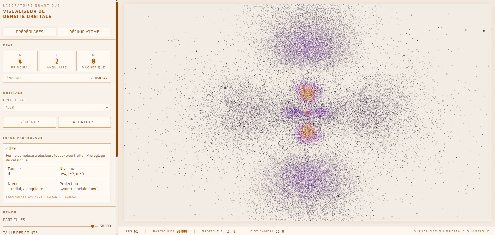

# Hydrogen Quantum Orbital Visualizer

<p align="center">
Visualisation interactive des orbitales quantiques de l’atome d’hydrogène directement dans le navigateur.
</p>

<p align="center">

</p>

---

## Présentation

**Hydrogen Quantum Orbital Visualizer** est un projet de visualisation scientifique web conçu pour explorer de manière interactive les **orbitales quantiques de l’atome d’hydrogène**.

L’application affiche des **densités de probabilité électronique** dérivées des solutions analytiques de l’**équation de Schrödinger indépendante du temps**.

L’objectif est de proposer un outil **visuel, pédagogique et interactif**, accessible directement depuis un navigateur web moderne, sans installation lourde.

> Ce projet s’inspire du visualiseur d’orbitales hydrogène original développé par **Kavan Anderson**, réimplémenté ici à l’aide de **technologies web modernes**.

---

## Fonctionnalités

- Visualisation **3D interactive** des orbitales atomiques
- Manipulation en temps réel des **nombres quantiques**
- Génération procédurale de **nuages de probabilité électronique**
- Navigation fluide de la caméra (**rotation, zoom, déplacement**)
- Exécution **entièrement dans le navigateur**
- Visualisation pédagogique de concepts de **mécanique quantique**

---

## Modèle quantique

La fonction d’onde de l’atome d’hydrogène dépend de trois nombres quantiques.

| Symbole | Nom | Signification |
|------|------|------|
| `n` | Nombre quantique principal | Détermine le niveau d’énergie et la taille de l’orbitale |
| `l` | Nombre quantique azimutal | Détermine la forme de l’orbitale |
| `m` | Nombre quantique magnétique | Détermine l’orientation spatiale |

La densité de probabilité électronique visualisée dans l’application correspond à :

\[
|\Psi_{n l m}(r, \theta, \phi)|^2
\]

Cette valeur représente la probabilité de trouver l’électron en un point donné de l’espace.

---

## Types d’orbitales

Le visualiseur permet d’explorer plusieurs familles d’orbitales.

| Orbitale | Description |
|------|------|
| `s` | Orbitales à symétrie sphérique |
| `p` | Orbitales avec structures nodales planes |
| `d` | Géométries plus complexes à plusieurs lobes |
| États excités | Configurations de plus haute énergie |

---

## Pile technologique

| Technologie | Rôle |
|------|------|
| HTML5 | Structure de l’application |
| CSS3 | Mise en forme |
| JavaScript (ES6+) | Logique de l’application |
| WebGL | Rendu graphique accéléré par le matériel |
| Three.js | Rendu 3D |

---

## Installation

### Cloner le dépôt

```bash
git clone https://github.com/votre-utilisateur/orbital-visualizer.git
cd orbital-visualizer
```

### Lancer un serveur local

Exemple avec **npx serve** :

```bash
npx serve .
```

Vous pouvez également utiliser **Live Server** dans VS Code.

### Ouvrir l’application

```text
http://localhost:3000
```

---

## Structure du projet

```text
orbital-visualizer/
├── index.html
├── style.css
├── script.js
├── screenshot.png
└── README.md
```

---

## Origine du projet

Ce projet s’inspire du travail de **Kavan Anderson**.

Dépôt original  
`https://github.com/kavan010/Atoms`

Démo originale  
`https://www.kavang.com/atom`

L’implémentation originale a été réalisée en **C++ / OpenGL**.  
Cette version est une **implémentation web indépendante** utilisant **WebGL et Three.js**.

---

## Objectifs

- Rendre la **mécanique quantique plus accessible visuellement**
- Proposer une **visualisation scientifique interactive**
- Démontrer la puissance des **technologies web pour le rendu scientifique**
- Servir de base à des **expérimentations pédagogiques**

---

## Licence

Ce projet est fourni à des fins **éducatives et de démonstration**.

Le crédit conceptuel de la visualisation originale revient à **Kavan Anderson**.

---

<p align="center">
Développé avec Three.js • Inspiré par Kavan Anderson
</p>
