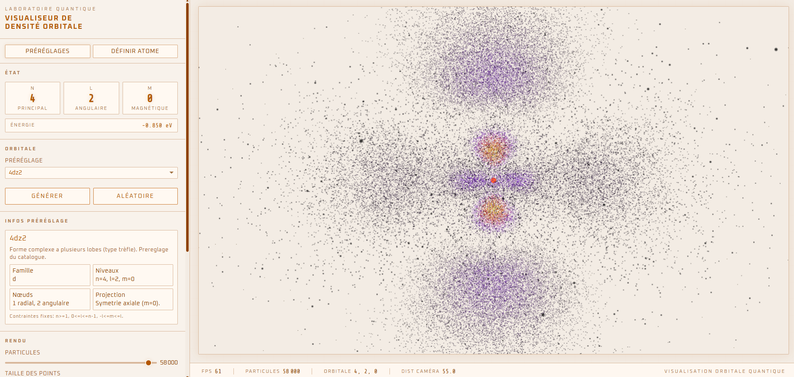

# Hydrogen Quantum Orbital Visualizer

<p align="center">
  
</p>

<p align="center">
  Visualisation interactive des orbitales quantiques de l’atome d’hydrogène directement dans le navigateur.
</p>

<p align="center">
  <a href="https://github.com/votre-utilisateur/orbital-visualizer/actions"></a>
  <a href="https://github.com/votre-utilisateur/orbital-visualizer/stargazers"></a>
  <a href="https://github.com/votre-utilisateur/orbital-visualizer/issues"></a>
  <a href="https://threejs.org/"></a>
</p>

---

## Table des matières

- [Présentation](#présentation)
- [Fonctionnalités](#fonctionnalités)
- [Modèle quantique](#modèle-quantique)
- [Types d’orbitales](#types-dorbitales)
- [Pile technologique](#pile-technologique)
- [Installation](#installation)
- [Utilisation](#utilisation)
- [Structure du projet](#structure-du-projet)
- [Captures d'écran](#captures-décran)
- [Contribution](#contribution)
- [Origine du projet](#origine-du-projet)
- [Objectifs](#objectifs)

---

## Présentation

**Hydrogen Quantum Orbital Visualizer** est un outil web interactif conçu pour explorer les **orbitales quantiques de l’atome d’hydrogène**. Il permet de visualiser en 3D les **densités de probabilité électronique** basées sur les solutions analytiques de l’**équation de Schrödinger indépendante du temps**.

Ce projet vise à rendre la mécanique quantique plus accessible et pédagogique, en offrant une expérience interactive directement dans un navigateur web moderne, sans besoin d’installation lourde. Il est idéal pour les étudiants, enseignants et passionnés de physique quantique.

> **Note** : Ce projet est une réimplémentation web moderne inspirée du visualiseur original de **Kavan Anderson**. Il utilise des technologies web pour une accessibilité accrue.

Démonstration en ligne : [Accéder à la démo](https://votre-utilisateur.github.io/orbital-visualizer/) .

---

## Fonctionnalités

- **Visualisation 3D interactive** : Explorez les orbitales en temps réel avec rotation, zoom et déplacement de la caméra.
- **Manipulation des nombres quantiques** : Changez dynamiquement les valeurs de `n`, `l` et `m` pour observer les effets sur l’orbitale.
- **Génération procédurale** : Nuages de points représentant la densité de probabilité électronique, calculés en temps réel.
- **Options de personnalisation** : Ajustez la résolution, les couleurs et les niveaux de transparence pour une meilleure visualisation.
- **Mode pédagogique** : Affichage des formules et explications intégrées pour comprendre les concepts quantiques.
- **Performances optimisées** : Exécution fluide grâce à WebGL, même sur des appareils mobiles.
- **Exportation** : Sauvegardez des captures d’écran ou exportez des modèles 3D (format OBJ ou GLTF).

---

## Modèle quantique

La visualisation repose sur la fonction d’onde de l’atome d’hydrogène, définie par trois nombres quantiques principaux :

| Symbole | Nom | Signification | Valeurs possibles |
|---------|-----|--------------|-------------------|
| `n`    | Nombre quantique principal | Détermine le niveau d’énergie et la taille de l’orbitale | Entier ≥ 1 |
| `l`    | Nombre quantique azimutal | Détermine la forme de l’orbitale | Entier de 0 à n-1 |
| `m`    | Nombre quantique magnétique | Détermine l’orientation spatiale | Entier de -l à +l |

### Densité de probabilité

La densité de probabilité affichée est calculée comme suit :

|Ψₙₗₘ(r, θ, φ)|² = |Rₙₗ(r)|² · |Yₗₘ(θ, φ)|²

Où :
- Rₙₗ(r) est la partie radiale.
- Yₗₘ(θ, φ) est la partie angulaire (harmoniques sphériques).

Cette densité représente la probabilité de trouver l’électron en un point donné de l’espace.

## Types d’orbitales

Explorez diverses orbitales classées par leur forme et énergie :

| Type | Description | Exemples |
|------|-------------|----------|
| `s` (l=0) | Symétrie sphérique, sans nœuds angulaires | 1s, 2s, 3s |
| `p` (l=1) | Formes lobées avec un nœud plan | 2p_x, 2p_y, 2p_z |
| `d` (l=2) | Géométries complexes avec plusieurs lobes | 3d_xy, 3d_xz, etc. |
| `f` (l=3) | Structures encore plus élaborées | 4f et supérieurs |
| États excités | Orbitales de haute énergie avec nœuds radiaux multiples | n ≥ 4 |

---

## Pile technologique

| Technologie | Version | Rôle |
|-------------|---------|------|
| HTML5 | - | Structure de base de l’application |
| CSS3 | - | Styles et mise en forme responsive |
| TypeScript | 7.0.2 | Logique interactive et calculs quantiques |
| WebGL | 2.0 | Rendu 3D accéléré par GPU |
| Three.js | r185 | Bibliothèque pour la manipulation 3D et les scènes |
| npm | - | Gestion des dépendances et des commandes de développement |

Three.js et les outils de développement sont installés de façon reproductible depuis `package-lock.json` avec npm.

---

## Installation

### Prérequis
- Un navigateur web moderne (Chrome, Firefox, Edge) avec support WebGL.
- Node.js 24.19.0 LTS et npm.

### Étapes

1. **Cloner le dépôt** :
   ```bash
   git clone https://github.com/votre-utilisateur/orbital-visualizer.git
   cd orbital-visualizer
   ```

2. **Installer les dépendances** :
   ```bash
   npm install
   ```

3. **Lancer un serveur local** :
   ```bash
   npm run dev
   ```

4. **Ouvrir l’application** :
   Accédez à `http://localhost:5173` (ou au port indiqué par Vite).

---

## Utilisation

1. Ouvrez l’application dans votre navigateur.
2. Sélectionnez les nombres quantiques via l’interface (sliders ou inputs).
3. Interagissez avec la vue 3D : 
   - **Rotation** : Cliquez et glissez.
   - **Zoom** : Molette de souris ou pinch sur mobile.
   - **Déplacement** : Cliquez droit et glissez.
4. Explorez les options : Changez la densité de points, activez les labels quantiques, ou basculez en mode fil de fer.

Le point d’entrée de l’application est `src/main.ts`.

---

## Structure du projet

```
orbital-visualizer/
├── index.html          # Page principale
├── style.css           # Styles CSS
├── src/
│   └── main.ts         # Point d’entrée TypeScript et Three.js
├── screenshot.png      # Image d’aperçu
├── assets/             # (Optionnel) Modèles 3D ou textures supplémentaires
└── README.md           # Ce fichier
```

---

## Captures d'écran

<p align="center">
  
  
</p>

---

## Contribution

Les contributions sont les bienvenues ! Suivez ces étapes :

1. Forkez le dépôt.
2. Créez une branche : `git checkout -b feature/nouvelle-fonction`.
3. Committez vos changements : `git commit -m 'Ajout de nouvelle fonction'`.
4. Poussez : `git push origin feature/nouvelle-fonction`.
5. Ouvrez une Pull Request.

Veuillez respecter le [Code de Conduite](CODE_OF_CONDUCT.md) (ajoutez-en un si nécessaire). Rapportez les bugs via les [Issues](https://github.com/votre-utilisateur/orbital-visualizer/issues).

Idées de contributions : Ajout de support pour d’autres atomes, optimisation mobile, ou internationalisation.

---

## Origine du projet

Ce projet est inspiré du visualiseur d’orbitales original de **Kavan Anderson** (C++ / OpenGL).

- Dépôt original : [github.com/kavan010/Atoms](https://github.com/kavan010/Atoms)
- Démo originale : [kavang.com/atom](https://www.kavang.com/atom)

Cette version est une réimplémentation indépendante en technologies web, avec des améliorations pour l’interactivité et l’accessibilité.

---

## Objectifs

- Rendre la **mécanique quantique visuellement intuitive** pour l’éducation.
- Fournir un outil **interactif** pour la visualisation scientifique.
- Démontrer les capacités des **technologies web** (WebGL, Three.js) pour des simulations complexes.
- Encourager des **expérimentations pédagogiques** et des extensions communautaires.

---


<p align="center">
  Développé avec Three.js • Inspiré de Kavan Anderson
</p>

Si vous appréciez ce projet, donnez une ⭐ sur GitHub ! Pour toute question, ouvrez une issue.
