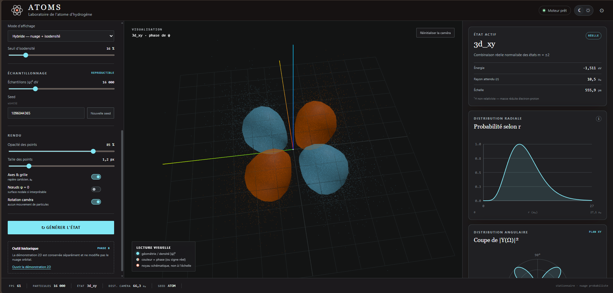
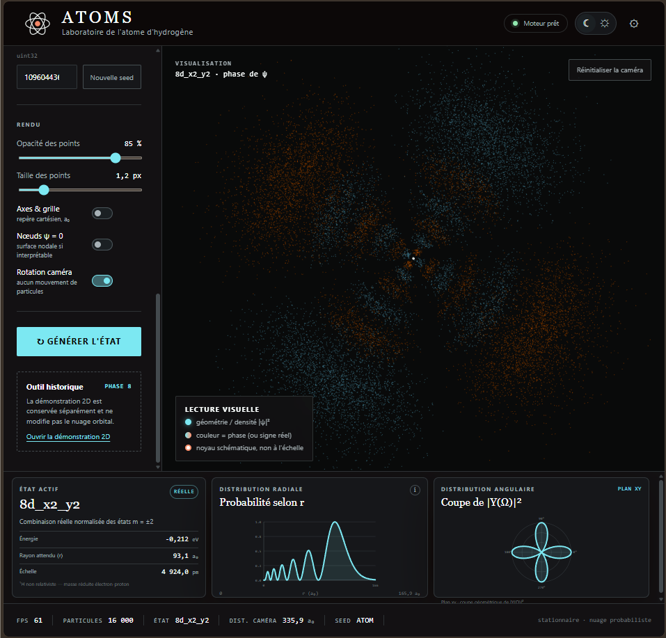
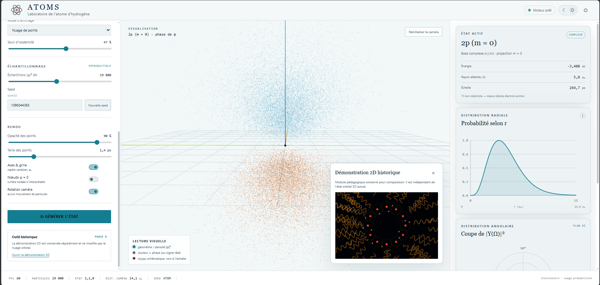

# Hydrogen Quantum Orbital Visualizer

Atoms is an independent web reimplementation and scientific evolution of Kavan's pedagogical
`kavan010/Atoms` project. Its pure TypeScript science core provides tested hydrogen wavefunctions,
probability densities, and real-orbital combinations. The visible 3D application now consumes that
core through one deterministic sampler, a versioned Web Worker and a Three.js renderer; the historical
2D demonstration remains explicitly isolated as Phase 8. See the [scientific contract](docs/SCIENCE.md)
for scope, formulas, conventions, units, sources, and validation boundaries.

<p align="center">
  
</p>

<p align="center">
  <sub><strong>3d<sub>xy</sub></strong> · base réelle · n = 3, l = 2 · combinaison normalisée issue des composantes m = ±2 · phase de ψ · rendu hybride · 16 000 échantillons</sub>
</p>

<p align="center">
  Visualisation interactive des orbitales quantiques de l’atome d’hydrogène directement dans le navigateur.
</p>

<p align="center">
  <a href="https://github.com/Giscolab/Atoms/actions"></a>
  <a href="https://github.com/Giscolab/Atoms"></a>
  <a href="https://github.com/Giscolab/Atoms/issues"></a>
  <a href="https://threejs.org/"></a>
</p>

---

## Table des matières

- [Présentation](#présentation)
- [Fonctionnalités](#fonctionnalités)
- [Modèle quantique](#modèle-quantique)
- [Types d’orbitales](#types-dorbitales)
- [Pile technologique](#pile-technologique)
- [Installation](#installation)
- [Utilisation](#utilisation)
- [Captures d'écran](#captures-décran)
- [Contribution](#contribution)
- [Objectifs](#objectifs)

---

## Présentation

**Hydrogen Quantum Orbital Visualizer** est un outil web interactif conçu pour explorer les **orbitales quantiques de l’atome d’hydrogène**. Il permet de visualiser en 3D les **densités de probabilité électronique** basées sur les solutions analytiques de l’**équation de Schrödinger indépendante du temps**.

Ce projet vise à rendre la mécanique quantique plus accessible et pédagogique, en offrant une expérience interactive directement dans un navigateur web moderne, sans besoin d’installation lourde. Il est idéal pour les étudiants, enseignants et passionnés de physique quantique.

> **Note** : Ce projet est une réimplémentation web moderne inspirée du visualiseur original de **Kavan Anderson**. Il utilise des technologies web pour une accessibilité accrue.

Dépôt public : [github.com/Giscolab/Atoms](https://github.com/Giscolab/Atoms).

**Démonstration en ligne : [giscolab.github.io/Atoms](https://giscolab.github.io/Atoms/)**

---

## Fonctionnalités

- **Visualisation 3D interactive** : explorez les orbitales avec rotation volontaire de la caméra,
  zoom et réinitialisation du cadrage dans un repère en `a₀`.
- **États complexes et orbitales réelles distincts** : choisissez `n`, `l`, `m` dans la base
  complexe ou les combinaisons réelles `p`/`d` disponibles, sans assimiler un `m` isolé à `pₓ` ou `pᵧ`.
- **Nuage probabiliste** : les positions sont échantillonnées selon `|ψ|² dV` dans un Web Worker.
  Les points représentent une distribution, jamais des électrons individuels ou une trajectoire.
- **Modes scientifiques** : densité, phase et mode hybride, avec isosurface de densité et surface
  nodale `ψ = 0` uniquement lorsque cette dernière est interprétable.
- **Analyses latérales** : courbe radiale `r²|Rₙₗ|²`, coupe géométrique de `|Yₗᵐ|²`, énergie du
  modèle à masse réduite, rayon attendu et nombres de nœuds.
- **Reproductibilité et thèmes** : seed `uint32` affichée, génération relançable, thèmes sombre et
  clair équivalents, responsive et respect de `prefers-reduced-motion`.

---

## Modèle quantique

La visualisation repose sur la fonction d’onde de l’atome d’hydrogène, définie par trois nombres quantiques principaux :

| Symbole | Nom | Signification | Valeurs possibles |
|---------|-----|--------------|-------------------|
| `n`    | Nombre quantique principal | Détermine le niveau d’énergie et la taille de l’orbitale | Entier ≥ 1 |
| `l`    | Nombre quantique azimutal | Détermine la forme de l’orbitale | Entier de 0 à n-1 |
| `m`    | Nombre quantique magnétique | Détermine l’orientation spatiale | Entier de -l à +l |

### Densité de probabilité

La densité de probabilité affichée est calculée comme suit :

|Ψₙₗₘ(r, θ, φ)|² = |Rₙₗ(r)|² · |Yₗₘ(θ, φ)|²

Où :
- Rₙₗ(r) est la partie radiale.
- Yₗₘ(θ, φ) est la partie angulaire (harmoniques sphériques).

Cette quantité est une densité de probabilité volumique ; une probabilité finie s'obtient après
intégration sur un volume.
La mesure volumique utilisée pour le sampling est `|Ψ|² r² sin(θ) dr dθ dφ`, tandis que la valeur
de densité stockée reste `|Ψ|²` sans jacobien. Les conventions et les limites du modèle sont
détaillées dans le [contrat scientifique](docs/SCIENCE.md).

## Types d’orbitales

Explorez diverses orbitales classées par leur forme et énergie :

| Type | Description | Exemples |
|------|-------------|----------|
| `s` (l=0) | Symétrie sphérique, sans nœuds angulaires | 1s, 2s, 3s |
| `p` (l=1) | Formes lobées avec un nœud plan | 2p_x, 2p_y, 2p_z |
| `d` (l=2) | Géométries complexes avec plusieurs lobes | 3d_xy, 3d_xz, etc. |
| `f` (l=3) | Structures encore plus élaborées | 4f et supérieurs |
| États excités | Orbitales de haute énergie avec nœuds radiaux multiples | n ≥ 4 |

---

## Pile technologique

| Technologie | Version | Rôle |
|-------------|---------|------|
| HTML5 | - | Structure de base de l’application |
| CSS3 | - | Styles et mise en forme responsive |
| TypeScript | 7.0.2 | Logique interactive et calculs quantiques |
| WebGL | 2.0 | Rendu 3D accéléré par GPU |
| Three.js | r185 | Bibliothèque pour la manipulation 3D et les scènes |
| npm | - | Gestion des dépendances et des commandes de développement |

Three.js et les outils de développement sont installés de façon reproductible depuis `package-lock.json` avec npm.

---

## Installation

### Prérequis
- Un navigateur web moderne (Chrome, Firefox, Edge) avec support WebGL.
- Node.js 24.19.0 LTS et npm.

### Étapes

1. **Cloner le dépôt** :
   ```bash
   git clone https://github.com/Giscolab/Atoms.git
   cd Atoms
   ```

2. **Installer les dépendances** :
   ```bash
   npm install
   ```

3. **Lancer un serveur local** :
   ```bash
   npm run dev
   ```

4. **Ouvrir l’application** :
   Accédez à `http://localhost:5173` (ou au port indiqué par Vite).

---

## Utilisation

1. Ouvrez l’application dans votre navigateur.
2. Choisissez la base complexe ou une orbitale réelle, puis les nombres quantiques valides.
3. Choisissez l’observable (densité ou phase) et le mode d’affichage ; ajustez le seuil, l’opacité
   et le nombre de points si nécessaire.
4. Interagissez avec la vue 3D : glisser pour orienter la caméra, molette ou pinch pour zoomer,
   touche `0` ou bouton dédié pour réinitialiser la vue. La touche `Q` ouvre l’outil 2D historique.
5. Pour reproduire une génération, conservez la seed affichée et relancez « Générer l’état ».

---

## Captures d'écran

Ces captures documentent plusieurs usages du même pipeline orbital 3D. Elles servent à présenter
l’interface et ses conventions visuelles ; elles ne remplacent pas les futures régressions visuelles
automatisées décrites dans le plan de validation.

<p align="center">
  
</p>
<p align="center">
  <sub><strong>Vue de référence.</strong> Orbitale réelle 3d<sub>xy</sub> · n = 3, l = 2 · combinaison normalisée issue des composantes m = ±2 · phase de ψ · mode hybride · 16 000 échantillons. Cette vue réunit le nuage probabiliste, l’isosurface de densité et les analyses radiale et angulaire.</sub>
</p>

<p align="center">
  
</p>
<p align="center">
  <sub><strong>État excité étendu.</strong> Orbitale réelle 8d<sub>x²−y²</sub> · n = 8, l = 2 · combinaison normalisée issue des composantes m = ±2 · phase de ψ · nuage de points · 16 000 échantillons. Cette vue met en évidence l’extension spatiale et la structure radiale d’un état de grand n.</sub>
</p>

<p align="center">
  
</p>
<p align="center">
  <sub><strong>Frontière 3D/2D.</strong> Base complexe · état |2,1,0⟩ · 2p (m = 0) · phase de ψ · nuage de points · 29 000 échantillons. La capture montre le thème clair et l’ouverture du module 2D historique, lequel reste indépendant du calcul orbital 3D.</sub>
</p>

---

## Contribution

Les contributions sont les bienvenues ! Suivez ces étapes :

1. Forkez le dépôt.
2. Créez une branche : `git checkout -b feature/nouvelle-fonction`.
3. Committez vos changements : `git commit -m 'Ajout de nouvelle fonction'`.
4. Poussez : `git push origin feature/nouvelle-fonction`.
5. Ouvrez une Pull Request.

Consultez les [Issues](https://github.com/Giscolab/Atoms/issues) pour le suivi des bugs.

Idées de contributions : Ajout de support pour d’autres atomes, optimisation mobile, ou internationalisation.

---


## Objectifs

- Rendre la **mécanique quantique visuellement intuitive** pour l’éducation.
- Fournir un outil **interactif** pour la visualisation scientifique.
- Démontrer les capacités des **technologies web** (WebGL, Three.js) pour des simulations complexes.
- Encourager des **expérimentations pédagogiques** et des extensions communautaires.

---


<p align="center">
  Développé avec Three.js
</p>

Si vous appréciez ce projet, donnez une ⭐ sur GitHub ! Pour toute question, ouvrez une issue.
